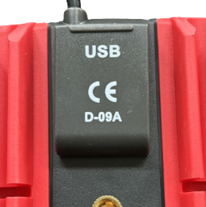
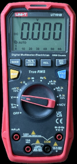

# ut161b
uni-t ut161b digital multimeter usb data read

### Scope

UNI-T 161B with UT  D09A data cable

|  | 


### Data cable D09A
serial port to HID device chip CH9329

uses built-in driver, 
HID-compliant vendor-defined device, 

VID 1A86
PID E429

### Raw HID 
simple way to receive 64byte data packets from DMM to PC

### protocol analysis
protocol to be decoded by vendor tool and wireshark

some parts of protocol decoding from https://github.com/ljakob/unit_ut61eplus.git


### python example 
 - open hid device 
 - send request cmds
 - send measure result request
 - parse meas result response
 - close device

**output:**
````
Connected to WCH UART TO KB-MS_V1.7
request  06 ab cd 03 5f 01 da
response 07 ab cd 04 ff 00 02 7b
request  06 ab cd 03 30 01 ab
response 0b ab cd 08 55 54 31 36 31 42 03 03
UT161B
request  06 ab cd 03 42 01 bd
response 07 ab cd 04 ff 00 02 7b
request  06 ab cd 03 5e 01 d9
response 13 ab cd 10 02 30 20 20 30 2e 30 30 30 00 00 30 30 30 03 78
Decoded meas result response:
  mode: DCV
 value: 0.000
  unit: V
 range: 2
````